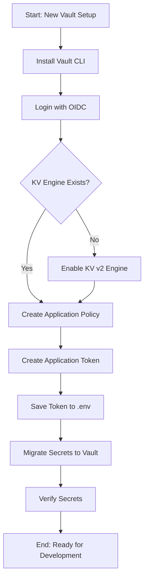
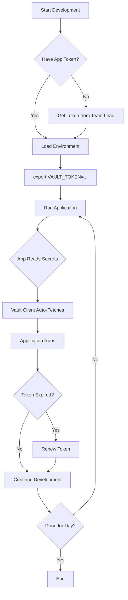
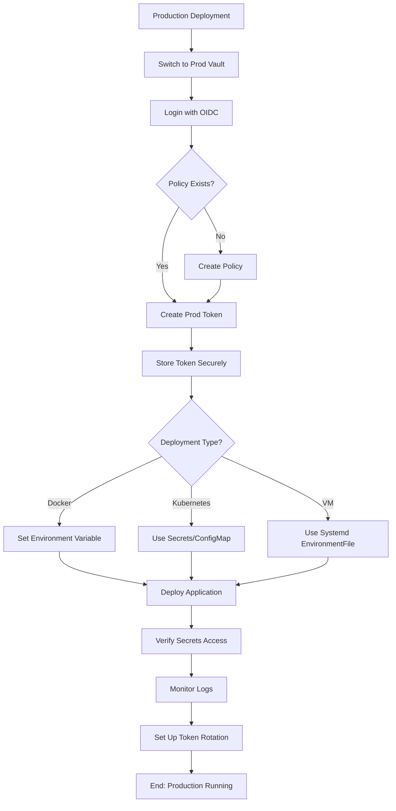

# Vault Deployment Guide
## Understanding HashiCorp Vault for AgenticTA

**Author:** AI Assistant  
**Last Updated:** 2025-11-11  
**Version:** 1.0

---

## Table of Contents

1. [Overview](#overview)
2. [Vault Token Types](#vault-token-types)
3. [Permission Model](#permission-model)
4. [Initial Setup Workflow](#initial-setup-workflow)
5. [Development Workflow](#development-workflow)
6. [Production Deployment](#production-deployment)
7. [Troubleshooting](#troubleshooting)
8. [Best Practices](#best-practices)

---

## Overview

### What is Vault?

HashiCorp Vault is a secrets management system that provides:
- **Centralized secret storage**: All API keys, tokens, and credentials in one place
- **Access control**: Fine-grained permissions on who/what can access secrets
- **Audit logging**: Track all secret access
- **Dynamic secrets**: Generate credentials on-demand
- **Encryption**: All secrets encrypted at rest and in transit

### Why Use Vault vs .env Files?

| Feature | .env Files | Vault |
|---------|-----------|-------|
| **Security** | ❌ Plaintext on disk | ✅ Encrypted |
| **Access Control** | ❌ File permissions only | ✅ Fine-grained policies |
| **Audit Logging** | ❌ None | ✅ Complete audit trail |
| **Secret Rotation** | ❌ Manual | ✅ Automated |
| **Multi-Environment** | ❌ Separate files | ✅ Namespaces |
| **Production-Ready** | ❌ No | ✅ Yes |

### Architecture Overview

```
┌─────────────────────────────────────────────────────────────┐
│                    NVIDIA Vault Server                       │
│         https://stg.internal.vault.nvidia.com                │
└─────────────────────────────────────────────────────────────┘
                            │
                            │ HTTPS + Token Auth
                            │
        ┌───────────────────┼───────────────────┐
        │                   │                   │
┌───────▼────────┐  ┌──────▼──────┐   ┌───────▼────────┐
│  Namespace:    │  │ Namespace:  │   │  Namespace:    │
│ wwfo-self-ta   │  │ team-prod   │   │  team-dev      │
│  (Staging)     │  │             │   │                │
└───────┬────────┘  └─────────────┘   └────────────────┘
        │
        │
┌───────▼──────────────────────────────────────────────────┐
│  KV Secrets Engine: secret/                               │
│                                                            │
│  ├── agenticta/                                           │
│  │   ├── api-keys                                         │
│  │   │   ├── nvidia_api_key                              │
│  │   │   ├── hf_token                                    │
│  │   │   └── ...                                         │
│  │   ├── auth-tokens                                     │
│  │   │   ├── astra_token                                 │
│  │   │   └── ...                                         │
│  │   └── observability                                   │
│  │       └── datadog_embedding_api_token                 │
│  │                                                        │
│  └── other-apps/                                         │
│      └── ...                                             │
└──────────────────────────────────────────────────────────┘
```

---

## Vault Token Types

Vault uses different token types for different purposes. Understanding these is **critical** for proper deployment.

### 1. OIDC Token (Human User Token) 👤

**How to Get:**
```bash
vault login -method=oidc -path=oidc-admins role=namespace-admin
```

**What Happens:**
1. Opens browser
2. Authenticates with NVIDIA SSO (your email/password)
3. Vault creates a token with `namespace-admin` role
4. Token saved to `~/.vault-token`

**Note:** The `-path=oidc-admins` and `role=namespace-admin` parameters are specific to NVIDIA's Vault configuration.

**Properties:**
```yaml
Token Type: OIDC (OpenID Connect)
Role: namespace-admin
TTL: 1 hour (short-lived)
Renewable: Yes (while you stay logged in)
Policies: ["default", "namespace-admin"]
```

**What You CAN Do:**
- ✅ List secrets engines (`vault secrets list`)
- ✅ Enable secrets engines (`vault secrets enable`)
- ✅ Create policies (`vault policy write`)
- ✅ Create application tokens (`vault token create`)
- ✅ Manage infrastructure

**What You CANNOT Do:**
- ❌ Read secret data (`secret/data/agenticta/*`)
- ❌ Write secret data
- ❌ Use in production (too short-lived)
- ❌ Use in applications (wrong permissions)

**Use Case:** Administrative setup only

**Example Token:**
```
hvs.CAESIK6jR0HuMN5WLNI1PQHplQWOrW-mJ1iWjZBHhSuN5KU8Gi...
```

---

### 2. Application Token (Service Account) 🔐

**How to Get:**
```bash
# Must be logged in with OIDC token first
vault token create \
    -policy=agenticta-secrets \
    -display-name="agenticta-app" \
    -ttl=720h \
    -format=json | jq -r '.auth.client_token'
```

**Properties:**
```yaml
Token Type: Token (programmatic)
Role: Custom (agenticta-secrets policy)
TTL: 720 hours (30 days) - configurable
Renewable: Yes (can extend before expiration)
Policies: ["default", "agenticta-secrets"]
```

**What You CAN Do:**
- ✅ Read secret data (`secret/data/agenticta/*`)
- ✅ Write secret data (`secret/data/agenticta/*`)
- ✅ List secrets at allowed paths
- ✅ Use in production (long-lived)
- ✅ Use in applications

**What You CANNOT Do:**
- ❌ Create policies
- ❌ Create tokens
- ❌ Enable secrets engines
- ❌ Manage infrastructure
- ❌ Access other namespaces
- ❌ Access secrets outside `agenticta/*`

**Use Case:** Application runtime (production & development)

**Example Token:**
```
hvs.CAESILXwJPWlW-OJDr3dZjImtSgCJ0o_RQ82n66VU-OLSKnTGi...
```

---

### 3. Root Token (God Mode) 👑

**How to Get:**
```bash
# Only during initial Vault initialization
vault operator init
```

**Properties:**
```yaml
Token Type: Root
Role: root (unlimited)
TTL: Never expires
Renewable: No (doesn't need to be)
Policies: ["root"] (bypasses all policies)
```

**What You CAN Do:**
- ✅ Everything - no restrictions

**What You SHOULD Do:**
- ⚠️ Use only for initial setup
- ⚠️ Revoke immediately after setup
- ⚠️ Never store in code or .env files
- ⚠️ Store securely offline (if at all)

**Use Case:** Vault bootstrap only (never in applications)

---

### Token Comparison Table

| Aspect | OIDC Token | Application Token | Root Token |
|--------|-----------|-------------------|------------|
| **Lifespan** | 1 hour | 30 days (configurable) | Forever |
| **Renewable** | ✅ Yes | ✅ Yes | N/A |
| **Create Policies** | ✅ Yes | ❌ No | ✅ Yes |
| **Create Tokens** | ✅ Yes | ❌ No | ✅ Yes |
| **Read Secrets** | ❌ No* | ✅ Yes | ✅ Yes |
| **Write Secrets** | ❌ No* | ✅ Yes | ✅ Yes |
| **Production Use** | ❌ No | ✅ Yes | ❌ No |
| **Who Uses It** | Human admins | Applications | No one (bootstrap only) |

\* Can manage secret *metadata* but not read/write actual secret *data*

---

## Permission Model

### Vault Paths Explained

Vault uses a hierarchical path structure. Understanding this is crucial:

```
vault-server/
├── sys/                    # System backend (for management)
│   ├── policies/          # Policy management
│   ├── auth/              # Auth method config
│   └── mounts/            # Secrets engine management
│
├── auth/                  # Authentication methods
│   ├── oidc/             # OIDC (SSO) login
│   └── token/            # Token management
│
└── secret/               # KV v2 secrets engine (mount point)
    ├── metadata/         # Secret metadata (versions, created_time)
    │   └── agenticta/   # App namespace
    │       ├── api-keys
    │       ├── auth-tokens
    │       └── observability
    │
    └── data/            # Actual secret data
        └── agenticta/   # App namespace
            ├── api-keys
            ├── auth-tokens
            └── observability
```

### Policy Examples

#### namespace-admin Policy (OIDC Token)

```hcl
# Can manage infrastructure
path "sys/policies/*" {
  capabilities = ["create", "read", "update", "delete", "list"]
}

path "sys/mounts/*" {
  capabilities = ["create", "read", "update", "delete", "list"]
}

path "auth/token/create" {
  capabilities = ["create", "update"]
}

# Can manage secret METADATA (not data)
path "secret/metadata/*" {
  capabilities = ["create", "read", "update", "delete", "list"]
}

# ❌ CANNOT access secret DATA
# (no path for secret/data/*)
```

#### agenticta-secrets Policy (Application Token)

```hcl
# Can read/write secret DATA
path "secret/data/agenticta/*" {
  capabilities = ["create", "read", "update", "delete", "list"]
}

# Can list and manage secret metadata
path "secret/metadata/agenticta/*" {
  capabilities = ["list", "read", "delete"]
}

# ❌ CANNOT manage infrastructure
# (no sys/* paths)

# ❌ CANNOT access other namespaces
# (only agenticta/* paths)
```

### Why This Separation?

**Principle of Least Privilege:**
1. **Admins** (OIDC) can set up infrastructure but don't need secret access
2. **Applications** can access secrets but can't reconfigure Vault
3. If an app token leaks, attackers can't create new policies or access other apps' secrets
4. Each component has exactly what it needs, nothing more

---

## Initial Setup Workflow

This is done **once** per namespace by an administrator.

### Prerequisites

- NVIDIA employee with SSO access
- Vault CLI installed
- Access to Vault namespace (`wwfo-self-ta`)

### Step-by-Step Setup



#### 1. Install Vault CLI

```bash
# macOS
brew install vault

# Linux
wget https://releases.hashicorp.com/vault/1.15.0/vault_1.15.0_linux_amd64.zip
unzip vault_1.15.0_linux_amd64.zip
sudo mv vault /usr/local/bin/
```

#### 2. Login with OIDC (Get Admin Token)

```bash
export VAULT_ADDR=https://stg.internal.vault.nvidia.com
export VAULT_NAMESPACE=wwfo-self-ta

vault login -method=oidc -path=oidc-admins role=namespace-admin
```

**What happens:**
- Browser opens
- Login with NVIDIA email
- Token saved to `~/.vault-token`
- You now have `namespace-admin` role

**Verify:**
```bash
vault token lookup
# Should show:
# - policies: ["default", "namespace-admin"]
# - ttl: ~3600s (1 hour)
```

#### 3. Check if KV Engine Exists

```bash
vault secrets list
```

**Expected output:**
```
Path          Type         Description
----          ----         -----------
cubbyhole/    cubbyhole    per-token private secret storage
identity/     identity     identity store
secret/       kv           n/a          ← KV v2 engine
sys/          system       system endpoints
```

If you **don't** see `secret/`, enable it:

```bash
vault secrets enable -version=2 -path=secret kv
```

#### 4. Create Application Policy

Create a policy file:

```bash
cat > agenticta-secrets.hcl << 'EOF'
# Policy for AgenticTA application secrets
# Allows read/write to agenticta/* paths in the secret/ KV engine

# Full access to agenticta secret data
path "secret/data/agenticta/*" {
  capabilities = ["create", "read", "update", "delete", "list"]
}

# Access to agenticta secret metadata
path "secret/metadata/agenticta/*" {
  capabilities = ["list", "read", "delete"]
}
EOF
```

Upload the policy:

```bash
vault policy write agenticta-secrets agenticta-secrets.hcl
```

Verify:

```bash
vault policy list
# Should show: agenticta-secrets
```

#### 5. Create Application Token

```bash
# Create token with 30-day TTL
vault token create \
    -policy=agenticta-secrets \
    -display-name="agenticta-app" \
    -ttl=720h \
    -format=json | jq -r '.auth.client_token'
```

**Output:**
```
hvs.CAESILXwJPWlW-OJDr3dZjImtSgCJ0o_RQ82n66VU-OLSKnTGi...
```

**⚠️ IMPORTANT:** Save this token! You'll need it for your application.

#### 6. Save Token to Environment

```bash
# Option 1: Add to .env file (for local development)
cat >> .env << EOF
VAULT_TOKEN=hvs.CAESILXwJPWlW-OJDr3dZjImtSgCJ0o_RQ82n66VU-OLSKnTGi...
EOF

# Option 2: Create vault-specific env file
cat > .env.vault-staging << EOF
export VAULT_ADDR=https://stg.internal.vault.nvidia.com
export VAULT_NAMESPACE=wwfo-self-ta
export VAULT_TOKEN=hvs.CAESILXwJPWlW-OJDr3dZjImtSgCJ0o_RQ82n66VU-OLSKnTGi...
export VAULT_MOUNT_POINT=secret
EOF

# Then load it:
source .env.vault-staging
```

#### 7. Migrate Secrets to Vault

**First, switch to application token:**

```bash
# Export the application token
export VAULT_TOKEN=hvs.CAESILXwJPWlW-OJDr3dZjImtSgCJ0o_RQ82n66VU-OLSKnTGi...
```

**Run migration script:**

```bash
python scripts/vault/migrate_secrets_to_vault.py
```

**Or manually:**

```bash
# API Keys
vault kv put secret/agenticta/api-keys \
    nvidia_api_key="nvapi-xxx" \
    hf_token="hf_xxx"

# Auth Tokens
vault kv put secret/agenticta/auth-tokens \
    astra_token="Njhl..."

# Observability
vault kv put secret/agenticta/observability \
    datadog_embedding_api_token="Njhm..."
```

#### 8. Verify Secrets

```bash
make vault-check

# Or manually:
python scripts/vault/list_secrets.py
```

**Expected output:**
```
✅ All required secrets are in Vault!
Paths:   3/3 found
Secrets: 4/4 found
```

#### 9. Test Application

```bash
python test_vault.py
```

**Expected output:**
```
Authenticated: True
Secret written successfully to secret/data/agenticta/test
Access granted!
```

---

## Development Workflow

Daily workflow for developers using Vault.



### Daily Development Steps

#### 1. Set Up Environment

```bash
# Option 1: Source vault environment
cd /path/to/AgenticTA
source .env.vault-staging

# Option 2: Export manually
export VAULT_ADDR=https://stg.internal.vault.nvidia.com
export VAULT_NAMESPACE=wwfo-self-ta
export VAULT_TOKEN=hvs.CAESILXwJPWlW...
export VAULT_MOUNT_POINT=secret
```

#### 2. Verify Vault Connection

```bash
make vault-check
```

#### 3. Run Application

```bash
# Local development
python gradioUI.py

# With Docker
make up-with-vault
```

#### 4. Application Automatically Fetches Secrets

The application will:
1. Check for `VAULT_TOKEN` environment variable
2. If present, connect to Vault
3. Fetch secrets from `secret/data/agenticta/*`
4. Cache secrets for 1 hour (configurable)
5. Fall back to `.env` if Vault is unavailable

**No code changes needed!** The `vault` module handles everything.

### Token Renewal

Application tokens expire after 30 days. To renew:

```bash
# Check token status
vault token lookup

# Renew token (extends TTL)
vault token renew

# Or create a new token if expired (requires OIDC login)
vault login -method=oidc -path=oidc-admins role=namespace-admin
vault token create -policy=agenticta-secrets -ttl=720h
```

**Automatic Renewal:**

The AgenticTA application has automatic token renewal built-in via `vault_init.py`:

```python
# vault_init.py runs on startup
import vault_init  # Starts background token renewal

# Renews token every 24 hours automatically
# Logs renewal status
```

---

## Production Deployment

Deploying to production environments.



### Production Setup

#### 1. Switch to Production Vault

```bash
# Production environment
export VAULT_ADDR=https://prod.internal.vault.nvidia.com
export VAULT_NAMESPACE=wwfo-self-ta

# Login as admin
vault login -method=oidc -path=oidc-admins role=namespace-admin
```

#### 2. Create Production Policy

```bash
# Same policy as staging, but review security
vault policy write agenticta-secrets-prod agenticta-secrets.hcl
```

#### 3. Create Production Token

```bash
# Longer TTL for production (90 days)
vault token create \
    -policy=agenticta-secrets-prod \
    -display-name="agenticta-prod" \
    -ttl=2160h \
    -format=json | jq -r '.auth.client_token'
```

**⚠️ CRITICAL:** Never commit production tokens to Git!

#### 4. Store Token Securely

**Option 1: CI/CD Secrets (Recommended)**

```yaml
# GitLab CI/CD
variables:
  VAULT_TOKEN:
    value: "hvs.CAESIL..."
    protected: true
    masked: true

# GitHub Actions
secrets:
  VAULT_TOKEN: hvs.CAESIL...
```

**Option 2: Kubernetes Secrets**

```bash
kubectl create secret generic vault-token \
    --from-literal=VAULT_TOKEN=hvs.CAESIL... \
    --namespace=agenticta
```

**Option 3: HashiCorp Vault Agent (Advanced)**

Use Vault Agent to automatically inject secrets into pods.

#### 5. Deploy Application

**Docker Compose:**

```yaml
# docker-compose.vault-prod.yml
services:
  agenticta:
    image: agenticta:latest
    environment:
      - VAULT_ADDR=https://prod.internal.vault.nvidia.com
      - VAULT_NAMESPACE=wwfo-self-ta
      - VAULT_TOKEN=${VAULT_TOKEN}  # From .env or CI/CD
      - VAULT_MOUNT_POINT=secret
```

```bash
# Deploy
export VAULT_TOKEN=hvs.CAESIL...
docker-compose -f docker-compose.vault-prod.yml up -d
```

**Kubernetes:**

```yaml
apiVersion: v1
kind: Pod
metadata:
  name: agenticta
spec:
  containers:
  - name: app
    image: agenticta:latest
    env:
    - name: VAULT_ADDR
      value: "https://prod.internal.vault.nvidia.com"
    - name: VAULT_NAMESPACE
      value: "wwfo-self-ta"
    - name: VAULT_TOKEN
      valueFrom:
        secretKeyRef:
          name: vault-token
          key: VAULT_TOKEN
    - name: VAULT_MOUNT_POINT
      value: "secret"
```

#### 6. Verify Production Access

```bash
# SSH into production server
ssh production-server

# Check Vault access
export VAULT_TOKEN=hvs.CAESIL...
make vault-check

# Check application logs
docker logs agenticta | grep -i vault
```

**Expected output:**
```
2025-11-11 10:00:00 - INFO - 🔐 Vault Status: ACTIVE
2025-11-11 10:00:00 - INFO - 📍 Using Vault: https://prod.internal.vault.nvidia.com
2025-11-11 10:00:00 - INFO - ✅ Successfully loaded 4 secrets from Vault
```

#### 7. Set Up Token Rotation

**Manual Rotation (Every 90 days):**

```bash
# 1. Login as admin
vault login -method=oidc -path=oidc-admins role=namespace-admin

# 2. Create new token
NEW_TOKEN=$(vault token create -policy=agenticta-secrets-prod -ttl=2160h -format=json | jq -r '.auth.client_token')

# 3. Update application
kubectl set env deployment/agenticta VAULT_TOKEN=$NEW_TOKEN

# 4. Verify
kubectl rollout status deployment/agenticta
```

**Automated Rotation (Recommended):**

Set up a cron job or CI/CD pipeline to rotate tokens automatically before expiration.

---

## Troubleshooting

### Common Errors and Solutions

#### 1. "permission denied" Error

**Error:**
```
hvac.exceptions.Forbidden: 1 error occurred:
        * permission denied
```

**Cause:** Using wrong token type (OIDC token instead of application token)

**Solution:**
```bash
# Check current token
vault token lookup

# If it shows "namespace-admin" policy, create app token:
vault token create -policy=agenticta-secrets -ttl=720h

# Export the new token
export VAULT_TOKEN=<new-token>
```

#### 2. "invalid mount path" Error

**Error:**
```
hvac.exceptions.InvalidPath: invalid mount path
```

**Cause:** Missing `mount_point` parameter in API call

**Solution:**
```python
# ❌ Wrong
client.secrets.kv.v2.read_secret_version(path='agenticta/api-keys')

# ✅ Correct
client.secrets.kv.v2.read_secret_version(
    mount_point='secret',
    path='agenticta/api-keys'
)
```

#### 3. Namespace Not Working

**Error:**
```
Error: namespace not found
```

**Cause:** Namespace not set in client initialization

**Solution:**
```python
# ❌ Wrong
client = hvac.Client(url=vault_addr, token=vault_token)

# ✅ Correct
client = hvac.Client(
    url=vault_addr,
    token=vault_token,
    namespace=vault_namespace  # Add this!
)
```

#### 4. Token Expired

**Error:**
```
Error: permission denied (token expired)
```

**Solution:**
```bash
# Renew if within renewal period
vault token renew

# Or create new token
vault login -method=oidc -path=oidc-admins role=namespace-admin
vault token create -policy=agenticta-secrets -ttl=720h
```

#### 5. Secrets Not Found

**Error:**
```
hvac.exceptions.InvalidPath: secret not found
```

**Diagnosis:**
```bash
# List all secrets
vault kv list secret/agenticta

# Check specific secret
vault kv get secret/agenticta/api-keys
```

**Solution:**
```bash
# Create missing secret
vault kv put secret/agenticta/api-keys \
    nvidia_api_key="nvapi-xxx"
```

#### 6. Application Falls Back to .env

**Symptom:** Logs show "Using .env file"

**Cause:** `VAULT_TOKEN` not set or invalid

**Solution:**
```bash
# Check environment
echo $VAULT_TOKEN

# Verify token
vault token lookup

# Export correct token
export VAULT_TOKEN=hvs.CAESIL...
```

### Debug Checklist

When things go wrong, check:

```bash
# 1. Environment variables
echo $VAULT_ADDR          # Should be set
echo $VAULT_NAMESPACE     # Should be set
echo $VAULT_TOKEN         # Should be set (application token)
echo $VAULT_MOUNT_POINT   # Should be 'secret'

# 2. Token validity
vault token lookup        # Should show agenticta-secrets policy

# 3. Secrets exist
make vault-check          # Should show all secrets found

# 4. Network connectivity
curl -k $VAULT_ADDR/v1/sys/health  # Should return 200

# 5. Application logs
docker logs agenticta | grep -i vault  # Check for errors
```

---

## Best Practices

### Security

1. **Never Commit Tokens to Git**
   ```bash
   # Add to .gitignore
   .env
   .env.vault-*
   **/vault-token*
   ```

2. **Use Short-Lived Tokens in Development**
   ```bash
   # Development: 7 days
   vault token create -policy=agenticta-secrets -ttl=168h
   ```

3. **Use Long-Lived Tokens in Production**
   ```bash
   # Production: 90 days with auto-renewal
   vault token create -policy=agenticta-secrets -ttl=2160h
   ```

4. **Rotate Tokens Regularly**
   - Development: Every 7-30 days
   - Production: Every 90 days
   - Immediately if compromised

5. **Principle of Least Privilege**
   ```hcl
   # ✅ Good: Specific path
   path "secret/data/agenticta/*" {
     capabilities = ["read"]
   }
   
   # ❌ Bad: Wildcard
   path "secret/data/*" {
     capabilities = ["read"]
   }
   ```

6. **Use Namespaces for Isolation**
   - Staging: `wwfo-self-ta`
   - Production: `wwfo-self-ta-prod`
   - Development: `wwfo-self-ta-dev`

### Development

1. **Use Vault for Secrets, .env for Config**
   ```bash
   # .env (non-sensitive config)
   DEBUG=true
   LOG_LEVEL=info
   
   # Vault (sensitive secrets)
   NVIDIA_API_KEY=nvapi-xxx
   ```

2. **Enable Vault Logging**
   ```python
   import logging
   logging.getLogger('hvac').setLevel(logging.DEBUG)
   ```

3. **Cache Secrets Appropriately**
   ```python
   # Good balance: 1 hour cache
   vault_client = VaultClient(cache_ttl=3600)
   ```

4. **Handle Vault Outages Gracefully**
   ```python
   try:
       secret = vault.get_secret('agenticta/api-keys', 'nvidia_api_key')
   except Exception as e:
       logger.warning(f"Vault unavailable: {e}")
       secret = os.getenv('NVIDIA_API_KEY')  # Fallback
   ```

### Operations

1. **Monitor Token Expiration**
   ```bash
   # Check TTL
   vault token lookup -format=json | jq -r '.data.ttl'
   ```

2. **Set Up Alerts**
   - Token expiring in < 7 days
   - Failed Vault authentication
   - Secrets access denied

3. **Backup Vault Secrets**
   ```bash
   # Export secrets (encrypted)
   python scripts/vault/backup_secrets.py > vault-backup-encrypted.json
   ```

4. **Document Token Locations**
   ```markdown
   # Token Inventory
   - CI/CD: GitLab CI/CD Variables
   - Kubernetes: Secret `vault-token` in namespace `agenticta`
   - Docker: Environment file `/etc/agenticta/.env`
   ```

5. **Audit Secret Access**
   ```bash
   # View Vault audit logs
   vault audit list
   ```

### Testing

1. **Test Vault Integration**
   ```bash
   make test-vault
   ```

2. **Test Fallback to .env**
   ```bash
   unset VAULT_TOKEN
   make test
   # Should use .env fallback
   ```

3. **Test Token Expiration Handling**
   ```python
   # test_vault_expiration.py
   def test_expired_token():
       # Use expired token
       with pytest.raises(VaultError):
           client.get_secret(...)
   ```

---

## Quick Reference

### Environment Variables

```bash
# Required
export VAULT_ADDR=https://stg.internal.vault.nvidia.com
export VAULT_NAMESPACE=wwfo-self-ta
export VAULT_TOKEN=hvs.CAESIL...

# Optional
export VAULT_MOUNT_POINT=secret  # Default: 'secret'
export VAULT_SKIP_VERIFY=false   # Skip TLS verification (dev only)
```

### Common Commands

```bash
# Setup
make vault-setup              # Initial setup (interactive)
make vault-check              # Verify secrets

# Development
make up-with-vault            # Start with Vault
make vault-test               # Test Vault connection

# Maintenance
vault token renew             # Renew token
vault token lookup            # Check token info
vault kv list secret/agenticta  # List secrets

# Troubleshooting
vault status                  # Check Vault server
vault auth list               # List auth methods
vault policy list             # List policies
```

### File Structure

```
AgenticTA/
├── .env                          # Local config (not secrets!)
├── .env.vault-staging           # Vault staging config
├── .env.vault-prod              # Vault production config
├── vault/                       # Vault integration code
│   ├── __init__.py
│   ├── client.py               # VaultClient class
│   ├── config.py               # Secrets configuration
│   └── token.py                # Token management
├── scripts/vault/
│   ├── migrate_secrets_to_vault.py
│   ├── list_secrets.py
│   └── backup_secrets.py
└── test_vault.py               # Vault integration test
```

---

## Summary

### Setup Flow
```
Admin (OIDC) → Enable KV Engine → Create Policy → Create App Token → Migrate Secrets
```

### Development Flow
```
Developer → Load App Token → Run Application → App Auto-Fetches Secrets
```

### Token Types
```
OIDC (1h)        → For setup/management
Application (30d) → For applications
Root (forever)    → Never use (bootstrap only)
```

### Key Takeaways

1. ✅ **Use application tokens** in your code, not OIDC tokens
2. ✅ **Set namespace parameter** in hvac.Client()
3. ✅ **Set mount_point parameter** in API calls
4. ✅ **Use agenticta/* paths** for secrets (matches policy)
5. ✅ **Rotate tokens regularly** (every 30-90 days)
6. ✅ **Never commit tokens** to Git
7. ✅ **Fall back to .env** gracefully during outages

---

**Questions?** Check [VAULT_README.md](VAULT_README.md) or [NVIDIA Vault Docs](https://gitlab-master.nvidia.com/kaizen/services/vault/docs)

